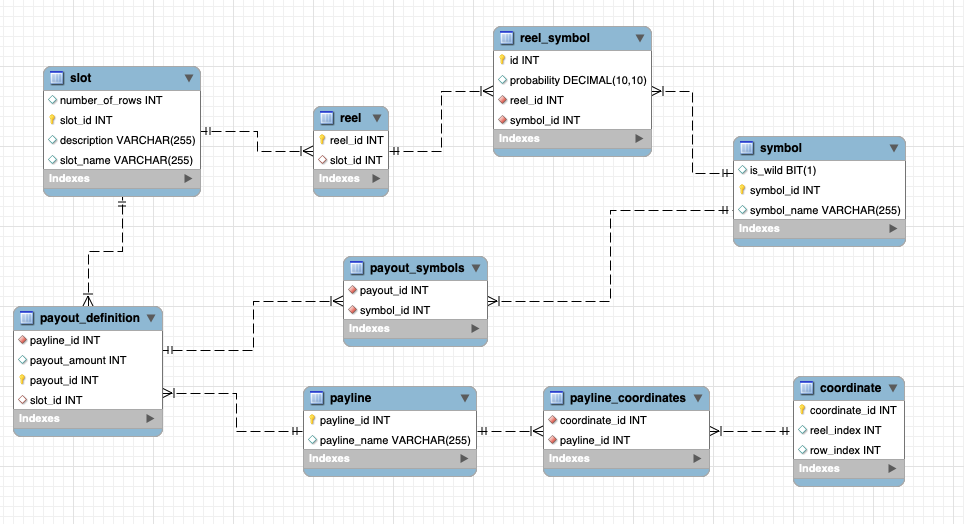

Current DB structure of this project:



Currently, this application supports single game by providing slot configuration and the payout definition to perform a single game simulation


This sample slot game using 5 reels x 3 rows as a demo
In the general design this can be extended

To run this project, run the application in profile = test, 
and pass both spring.datasource.username and spring.datasource.password

first identify the demo slot game config
<pre><code>GET /slot/1/get</code></pre>
```json
{
  "numberOfRows": 3,
  "numberOfReels": 5,
  "slotName": "Demo 1",
  "description": "Demo 5x3 slot design",
  "slotId": 1,
  "reels": [
    {
      "symbolProbSet": [
        {
          "symbol": {
            "symbolId": 1,
            "symbolName": "Apple",
            "wild": false
          },
          "probability": 0.9000000000
        },
        {
          "symbol": {
            "symbolId": 2,
            "symbolName": "Lemon",
            "wild": false
          },
          "probability": 0.0500000000
        },
        {
          "symbol": {
            "symbolId": 3,
            "symbolName": "Mango",
            "wild": false
          },
          "probability": 0.0500000000
        }
      ],
      "id": 1
    },
    {
      "symbolProbSet": [
        {
          "symbol": {
            "symbolId": 1,
            "symbolName": "Apple",
            "wild": false
          },
          "probability": 0.8000000000
        },
        {
          "symbol": {
            "symbolId": 2,
            "symbolName": "Lemon",
            "wild": false
          },
          "probability": 0.1000000000
        },
        {
          "symbol": {
            "symbolId": 3,
            "symbolName": "Mango",
            "wild": false
          },
          "probability": 0.1000000000
        }
      ],
      "id": 2
    },
    {
      "symbolProbSet": [
        {
          "symbol": {
            "symbolId": 1,
            "symbolName": "Apple",
            "wild": false
          },
          "probability": 0.7000000000
        },
        {
          "symbol": {
            "symbolId": 2,
            "symbolName": "Lemon",
            "wild": false
          },
          "probability": 0.2000000000
        },
        {
          "symbol": {
            "symbolId": 3,
            "symbolName": "Mango",
            "wild": false
          },
          "probability": 0.0500000000
        },
        {
          "symbol": {
            "symbolId": 4,
            "symbolName": "Pizza",
            "wild": false
          },
          "probability": 0.0500000000
        }
      ],
      "id": 3
    },
    {
      "symbolProbSet": [
        {
          "symbol": {
            "symbolId": 1,
            "symbolName": "Apple",
            "wild": false
          },
          "probability": 0.7000000000
        },
        {
          "symbol": {
            "symbolId": 2,
            "symbolName": "Lemon",
            "wild": false
          },
          "probability": 0.1000000000
        },
        {
          "symbol": {
            "symbolId": 3,
            "symbolName": "Mango",
            "wild": false
          },
          "probability": 0.1000000000
        },
        {
          "symbol": {
            "symbolId": 4,
            "symbolName": "Pizza",
            "wild": false
          },
          "probability": 0.0500000000
        },
        {
          "symbol": {
            "symbolId": 5,
            "symbolName": "Grape",
            "wild": false
          },
          "probability": 0.0500000000
        }
      ],
      "id": 4
    },
    {
      "symbolProbSet": [
        {
          "symbol": {
            "symbolId": 1,
            "symbolName": "Apple",
            "wild": false
          },
          "probability": 0.9000000000
        },
        {
          "symbol": {
            "symbolId": 2,
            "symbolName": "Lemon",
            "wild": false
          },
          "probability": 0.0500000000
        },
        {
          "symbol": {
            "symbolId": 3,
            "symbolName": "Mango",
            "wild": false
          },
          "probability": 0.0500000000
        }
      ],
      "id": 5
    }
  ],
  "numberOfConfiguredReels": 5
}
```

the sample spin result is as follows (Note that you may have different result because of the randomness)

<pre><code>GET /slotgame/1/spin</code></pre>
```json
{
  "spinOutcomes": [
    [
      {
        "symbolId": 1,
        "symbolName": "Apple",
        "wild": false
      },
      {
        "symbolId": 1,
        "symbolName": "Apple",
        "wild": false
      },
      {
        "symbolId": 1,
        "symbolName": "Apple",
        "wild": false
      }
    ],
    [
      {
        "symbolId": 1,
        "symbolName": "Apple",
        "wild": false
      },
      {
        "symbolId": 1,
        "symbolName": "Apple",
        "wild": false
      },
      {
        "symbolId": 2,
        "symbolName": "Lemon",
        "wild": false
      }
    ],
    [
      {
        "symbolId": 1,
        "symbolName": "Apple",
        "wild": false
      },
      {
        "symbolId": 2,
        "symbolName": "Lemon",
        "wild": false
      },
      {
        "symbolId": 2,
        "symbolName": "Lemon",
        "wild": false
      }
    ],
    [
      {
        "symbolId": 1,
        "symbolName": "Apple",
        "wild": false
      },
      {
        "symbolId": 1,
        "symbolName": "Apple",
        "wild": false
      },
      {
        "symbolId": 1,
        "symbolName": "Apple",
        "wild": false
      }
    ],
    [
      {
        "symbolId": 1,
        "symbolName": "Apple",
        "wild": false
      },
      {
        "symbolId": 1,
        "symbolName": "Apple",
        "wild": false
      },
      {
        "symbolId": 1,
        "symbolName": "Apple",
        "wild": false
      }
    ]
  ],
  "slotSpinPayouts": [
    {
      "payoutDefinition": {
        "payoutId": 1,
        "payline": {
          "paylineId": 1,
          "paylineName": "horizontal line 1",
          "coordinates": [
            {
              "reelIndex": 0,
              "rowIndex": 0
            },
            {
              "reelIndex": 1,
              "rowIndex": 0
            },
            {
              "reelIndex": 2,
              "rowIndex": 0
            },
            {
              "reelIndex": 3,
              "rowIndex": 0
            },
            {
              "reelIndex": 4,
              "rowIndex": 0
            }
          ]
        },
        "symbols": [
          {
            "symbolId": 1,
            "symbolName": "Apple",
            "wild": false
          },
          {
            "symbolId": 1,
            "symbolName": "Apple",
            "wild": false
          },
          {
            "symbolId": 1,
            "symbolName": "Apple",
            "wild": false
          },
          {
            "symbolId": 1,
            "symbolName": "Apple",
            "wild": false
          },
          {
            "symbolId": 1,
            "symbolName": "Apple",
            "wild": false
          }
        ],
        "payoutAmount": 3
      },
      "payoutAmount": 3
    },
    {
      "payoutDefinition": {
        "payoutId": 5,
        "payline": {
          "paylineId": 5,
          "paylineName": "inverted v shape",
          "coordinates": [
            {
              "reelIndex": 0,
              "rowIndex": 2
            },
            {
              "reelIndex": 1,
              "rowIndex": 1
            },
            {
              "reelIndex": 2,
              "rowIndex": 0
            },
            {
              "reelIndex": 3,
              "rowIndex": 1
            },
            {
              "reelIndex": 4,
              "rowIndex": 2
            }
          ]
        },
        "symbols": [
          {
            "symbolId": 1,
            "symbolName": "Apple",
            "wild": false
          },
          {
            "symbolId": 1,
            "symbolName": "Apple",
            "wild": false
          },
          {
            "symbolId": 1,
            "symbolName": "Apple",
            "wild": false
          },
          {
            "symbolId": 1,
            "symbolName": "Apple",
            "wild": false
          },
          {
            "symbolId": 1,
            "symbolName": "Apple",
            "wild": false
          }
        ],
        "payoutAmount": 3
      },
      "payoutAmount": 3
    },
    {
      "payoutDefinition": {
        "payoutId": 9,
        "payline": {
          "paylineId": 9,
          "paylineName": "w shape 1",
          "coordinates": [
            {
              "reelIndex": 0,
              "rowIndex": 0
            },
            {
              "reelIndex": 1,
              "rowIndex": 1
            },
            {
              "reelIndex": 2,
              "rowIndex": 0
            },
            {
              "reelIndex": 3,
              "rowIndex": 1
            },
            {
              "reelIndex": 4,
              "rowIndex": 0
            }
          ]
        },
        "symbols": [
          {
            "symbolId": 1,
            "symbolName": "Apple",
            "wild": false
          },
          {
            "symbolId": 1,
            "symbolName": "Apple",
            "wild": false
          },
          {
            "symbolId": 1,
            "symbolName": "Apple",
            "wild": false
          },
          {
            "symbolId": 1,
            "symbolName": "Apple",
            "wild": false
          },
          {
            "symbolId": 1,
            "symbolName": "Apple",
            "wild": false
          }
        ],
        "payoutAmount": 3
      },
      "payoutAmount": 3
    }
  ],
  "spinPayout": 9
}
```

Symbol configurations check the following endpoint
<pre><code>GET /symbol/list</code></pre>
```json
[
  {
    "symbolId": 1,
    "symbolName": "Apple",
    "wild": false
  },
  {
    "symbolId": 2,
    "symbolName": "Lemon",
    "wild": false
  },
  {
    "symbolId": 3,
    "symbolName": "Mango",
    "wild": false
  },
  {
    "symbolId": 4,
    "symbolName": "Pizza",
    "wild": false
  },
  {
    "symbolId": 5,
    "symbolName": "Grape",
    "wild": false
  },
  {
    "symbolId": 6,
    "symbolName": "Wild",
    "wild": true
  }
]
```

Payline configurations check the following endpoint

<pre><code>GET /payline/list</code></pre>

and the results:
```json
[
  {
    "paylineId": 1,
    "paylineName": "horizontal line 1",
    "coordinates": [
      {
        "reelIndex": 0,
        "rowIndex": 0
      },
      {
        "reelIndex": 1,
        "rowIndex": 0
      },
      {
        "reelIndex": 2,
        "rowIndex": 0
      },
      {
        "reelIndex": 3,
        "rowIndex": 0
      },
      {
        "reelIndex": 4,
        "rowIndex": 0
      }
    ]
  },
  {
    "paylineId": 2,
    "paylineName": "horizontal line 2",
    "coordinates": [
      {
        "reelIndex": 0,
        "rowIndex": 1
      },
      {
        "reelIndex": 1,
        "rowIndex": 1
      },
      {
        "reelIndex": 2,
        "rowIndex": 1
      },
      {
        "reelIndex": 3,
        "rowIndex": 1
      },
      {
        "reelIndex": 4,
        "rowIndex": 1
      }
    ]
  },
  {
    "paylineId": 3,
    "paylineName": "horizontal line 3",
    "coordinates": [
      {
        "reelIndex": 0,
        "rowIndex": 2
      },
      {
        "reelIndex": 1,
        "rowIndex": 2
      },
      {
        "reelIndex": 2,
        "rowIndex": 2
      },
      {
        "reelIndex": 3,
        "rowIndex": 2
      },
      {
        "reelIndex": 4,
        "rowIndex": 2
      }
    ]
  },
  {
    "paylineId": 4,
    "paylineName": "v shape",
    "coordinates": [
      {
        "reelIndex": 0,
        "rowIndex": 0
      },
      {
        "reelIndex": 1,
        "rowIndex": 1
      },
      {
        "reelIndex": 2,
        "rowIndex": 2
      },
      {
        "reelIndex": 3,
        "rowIndex": 1
      },
      {
        "reelIndex": 4,
        "rowIndex": 0
      }
    ]
  },
  {
    "paylineId": 5,
    "paylineName": "inverted v shape",
    "coordinates": [
      {
        "reelIndex": 0,
        "rowIndex": 2
      },
      {
        "reelIndex": 1,
        "rowIndex": 1
      },
      {
        "reelIndex": 2,
        "rowIndex": 0
      },
      {
        "reelIndex": 3,
        "rowIndex": 1
      },
      {
        "reelIndex": 4,
        "rowIndex": 2
      }
    ]
  },
  {
    "paylineId": 6,
    "paylineName": "m shape 1",
    "coordinates": [
      {
        "reelIndex": 0,
        "rowIndex": 1
      },
      {
        "reelIndex": 1,
        "rowIndex": 0
      },
      {
        "reelIndex": 2,
        "rowIndex": 1
      },
      {
        "reelIndex": 3,
        "rowIndex": 0
      },
      {
        "reelIndex": 4,
        "rowIndex": 1
      }
    ]
  },
  {
    "paylineId": 7,
    "paylineName": "m shape 2",
    "coordinates": [
      {
        "reelIndex": 0,
        "rowIndex": 2
      },
      {
        "reelIndex": 1,
        "rowIndex": 1
      },
      {
        "reelIndex": 2,
        "rowIndex": 2
      },
      {
        "reelIndex": 3,
        "rowIndex": 1
      },
      {
        "reelIndex": 4,
        "rowIndex": 2
      }
    ]
  },
  {
    "paylineId": 8,
    "paylineName": "m shape 3",
    "coordinates": [
      {
        "reelIndex": 0,
        "rowIndex": 2
      },
      {
        "reelIndex": 1,
        "rowIndex": 0
      },
      {
        "reelIndex": 2,
        "rowIndex": 2
      },
      {
        "reelIndex": 3,
        "rowIndex": 0
      },
      {
        "reelIndex": 4,
        "rowIndex": 2
      }
    ]
  },
  {
    "paylineId": 9,
    "paylineName": "w shape 1",
    "coordinates": [
      {
        "reelIndex": 0,
        "rowIndex": 0
      },
      {
        "reelIndex": 1,
        "rowIndex": 1
      },
      {
        "reelIndex": 2,
        "rowIndex": 0
      },
      {
        "reelIndex": 3,
        "rowIndex": 1
      },
      {
        "reelIndex": 4,
        "rowIndex": 0
      }
    ]
  },
  {
    "paylineId": 10,
    "paylineName": "w shape 2",
    "coordinates": [
      {
        "reelIndex": 0,
        "rowIndex": 1
      },
      {
        "reelIndex": 1,
        "rowIndex": 2
      },
      {
        "reelIndex": 2,
        "rowIndex": 1
      },
      {
        "reelIndex": 3,
        "rowIndex": 2
      },
      {
        "reelIndex": 4,
        "rowIndex": 1
      }
    ]
  },
  {
    "paylineId": 11,
    "paylineName": "w shape 3",
    "coordinates": [
      {
        "reelIndex": 0,
        "rowIndex": 0
      },
      {
        "reelIndex": 1,
        "rowIndex": 2
      },
      {
        "reelIndex": 2,
        "rowIndex": 0
      },
      {
        "reelIndex": 3,
        "rowIndex": 2
      },
      {
        "reelIndex": 4,
        "rowIndex": 0
      }
    ]
  }
]
```
